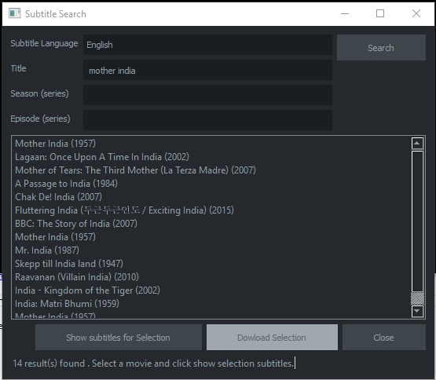

# subtitle-search

A GUI application for searching subtitles for movies/TV show by web scrapping.



## Dependencies
+ [Beautifulsoup](https://pypi.python.org/pypi/BeautifulSoup)
+ [Requests](https://pypi.python.org/pypi/requests)
+ [PySide](https://pypi.python.org/pypi/PySide)

## Installation
To install the script clone the repository and run the script
```
> git clone https://github.com/yemikudaisi/subtitle-search.git
> cd subtitle-search
> python subtitle_search.py
```
## How to use
+ Enter the movie title
+ Select a language
+ Click on search
+ At this point, the app will return a list of movies
+ Select a movie from the list and click on the show subtitle for selection button (this will fetch a list of subtitles specific to the selected language and movie)
+ Select one subtitle from the list and click on the download selection button
+ A save as dialog, choose a location and click ok
+ The required file will then be downloaded and saved to the specified location

## Issue Reporting

If you have found a bug or if you have a feature request, please report them at this repository issues section.

## Author

[Yemi Kudaisi](https://github.com/yemikudaisi)

## License

This project is licensed under the MIT license. See the [LICENSE](LICENSE) file for more info.
