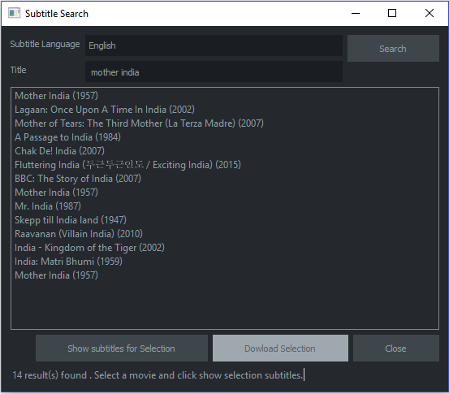

# subtitle-search

A GUI application for searching subtitles for movies/TV show by web scrapping.



## Dependencies
+ [Beautifulsoup](https://pypi.python.org/pypi/BeautifulSoup)
+ [Requests](https://pypi.python.org/pypi/requests)
+ [PySide](https://pypi.python.org/pypi/PySide)

## Installation
To install the script clone the repository and run the script
```
> git clone https://github.com/yemikudaisi/subtitle-search.git
> cd subtitle-search
> python subtitle_search.py
```
## How to use
+ Enter the movie title
+ click the search button
+ double click on list items from the result till the subtitle starts to download

## Issue Reporting

If you have found a bug or if you have a feature request, please report them at this repository issues section.

## Author

[Yemi Kudaisi](https://github.com/yemikudaisi)

## License

This project is licensed under the MIT license. See the [LICENSE](LICENSE) file for more info.
